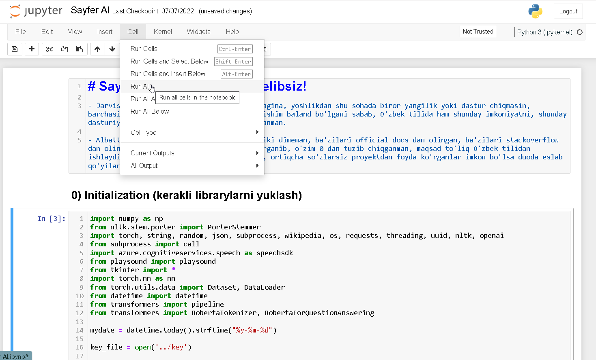

# SAYFER AI

Assalom alaykum, sayfer dasturi o'zbek tilidagi ovozli sun'iy intellektual yordamchi hisoblanadi. Dastur ochiq kodli (open-source), dasturda foydalanilgan ba'zi kutubxonalar (API yoki library) pullik, ulardan foydalanish uchun xizmatni taklif qilgan ba'zi kompaniyalarga karta ulash ishlatilgan resurslar uchun to'lov qilish talab qilinadi, albatta pullik xizmatlar o'chirib qo'yilib dasturni belgilangan resurslardan o'tkazmagan holatda tekin foydalanish mumkin).

## Sayfer dasturi talablari:

 - Python3.10 yoki undan yuqori
 - 2 GB minimal operativ xotira (RAM)
 - Audio I/O
 - 4 GB + xotira (SSD/HDD)
 - CPU (ahamiyatsiz)

## Dasturni ishga tushirish

     # Virtualenv .venv
     
     # .venv\Scripts\activate

     # git clone https://github.com/cyberspyde/Sayfer.git
   
     # unzip Sayfer.zip

     # cd Sayfer

     # pip install -m requirements.txt

## Jupyter notebook ni o'rnatish

     # pip install notebook, jupyterlab
   
     # jupyter notebook

Jupyter notebookni browserda ochgandan so'ng, Cell bo'limidan <Run All> ga bosib barcha cell larni ishga tushiriladi, barcha cell lar ishga tushishi uchun biroz vaqt kerak va Sayfer qo'shimcha modellarni internetdan yuklab oladi. Cell lar tugaganda esa dastur avtomat ishga tushadi, Windows paneldan mikrafon ikonkasi chiqishi bilan dasturdan foydalanishiz mumkin.

## Contributions (Hissa qo'shishlar)

**Dasturga hissa qo'shmoqchi bo'lganlar, repo ni fork qilib pull request qilganingizdan keyin o'zgarishlar/optimizatsiyalarni foydasiga qarab main repo ga qo'shib boraman). Hammaga rahmat!**

## Contact (Aloqa)

*Dasturga oid har qanday shikoyatlar, takliflar va g'oyalar uchun.*

[Telegram kanal](https://t.me/sayfer_uzbekistan)  
[Gmail](cyberspyde@gmail.com)  
[Instagram](https://instagram.com/cyberspyde)  
<a href="https://t.me/cyberspyde_admin" target="_blank"> Telegram </a> 
